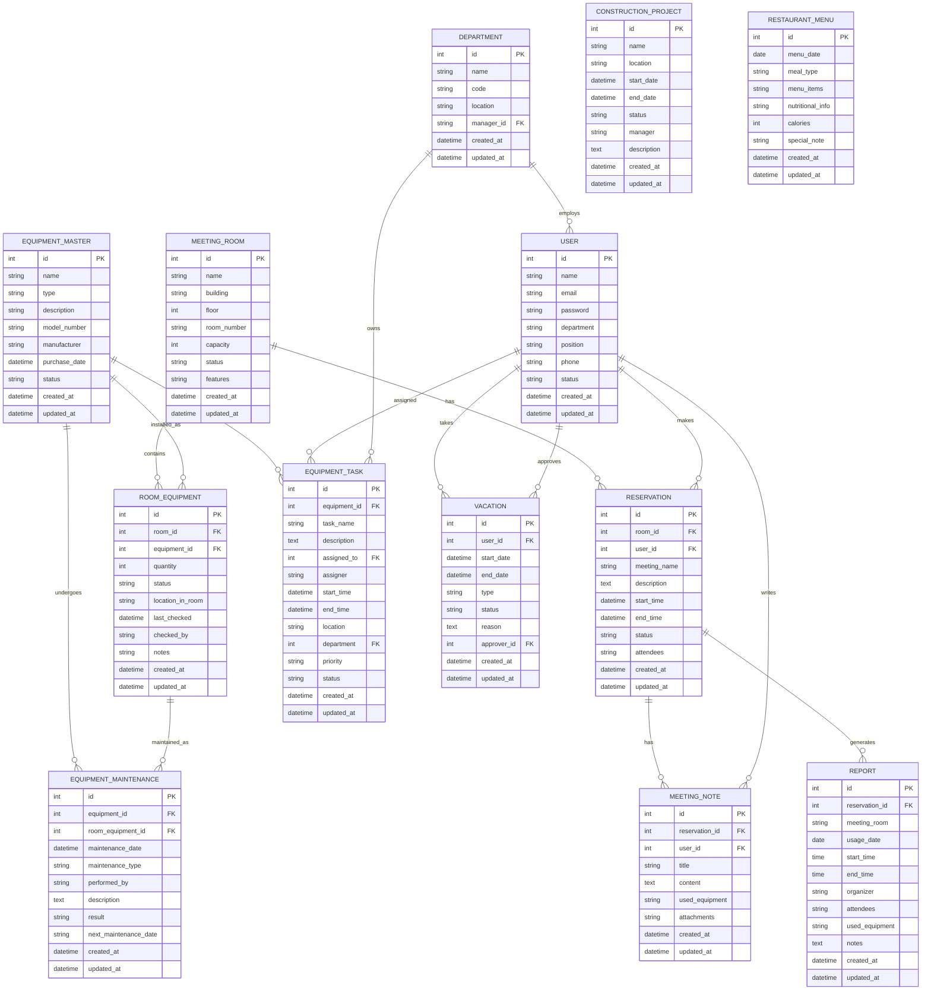

```mermaid
erDiagram
    MEETING_ROOM {
        int id PK
        string name
        string building
        int floor
        string room_number
        int capacity
        string status
        string features
        datetime created_at
        datetime updated_at
    }
    
    EQUIPMENT_MASTER {
        int id PK
        string name
        string type
        string description
        string model_number
        string manufacturer
        datetime purchase_date
        string status
        datetime created_at
        datetime updated_at
    }
    
    ROOM_EQUIPMENT {
        int id PK
        int room_id FK
        int equipment_id FK
        int quantity
        string status
        string location_in_room
        datetime last_checked
        string checked_by
        string notes
        datetime created_at
        datetime updated_at
    }
    
    RESERVATION {
        int id PK
        int room_id FK
        int user_id FK
        string meeting_name
        text description
        datetime start_time
        datetime end_time
        string status
        string attendees
        datetime created_at
        datetime updated_at
    }
    
    EQUIPMENT_TASK {
        int id PK
        int equipment_id FK
        string task_name
        text description
        int assigned_to FK
        string assigner
        datetime start_time
        datetime end_time
        string location
        int department FK
        string priority
        string status
        datetime created_at
        datetime updated_at
    }
    
    REPORT {
        int id PK
        int reservation_id FK
        string meeting_room
        date usage_date
        time start_time
        time end_time
        string organizer
        string attendees
        string used_equipment
        text notes
        datetime created_at
        datetime updated_at
    }
    
    USER {
        int id PK
        string name
        string email
        string password
        string department
        string position
        string phone
        string status
        datetime created_at
        datetime updated_at
    }
    
    DEPARTMENT {
        int id PK
        string name
        string code
        string location
        string manager_id FK
        datetime created_at
        datetime updated_at
    }
    
    MEETING_NOTE {
        int id PK
        int reservation_id FK
        int user_id FK
        string title
        text content
        string used_equipment
        string attachments
        datetime created_at
        datetime updated_at
    }
    
    VACATION {
        int id PK
        int user_id FK
        datetime start_date
        datetime end_date
        string type
        string status
        text reason
        int approver_id FK
        datetime created_at
        datetime updated_at
    }
    
    CONSTRUCTION_PROJECT {
        int id PK
        string name
        string location
        datetime start_date
        datetime end_date
        string status
        string manager
        text description
        datetime created_at
        datetime updated_at
    }
    
    RESTAURANT_MENU {
        int id PK
        date menu_date
        string meal_type
        string menu_items
        string nutritional_info
        int calories
        string special_note
        datetime created_at
        datetime updated_at
    }
    
    EQUIPMENT_MAINTENANCE {
        int id PK
        int equipment_id FK
        int room_equipment_id FK
        datetime maintenance_date
        string maintenance_type
        string performed_by
        text description
        string result
        string next_maintenance_date
        datetime created_at
        datetime updated_at
    }
    
    MEETING_ROOM ||--o{ RESERVATION : "has"
    MEETING_ROOM ||--o{ ROOM_EQUIPMENT : "contains"
    EQUIPMENT_MASTER ||--o{ ROOM_EQUIPMENT : "installed_as"
    EQUIPMENT_MASTER ||--o{ EQUIPMENT_TASK : "has"
    EQUIPMENT_MASTER ||--o{ EQUIPMENT_MAINTENANCE : "undergoes"
    ROOM_EQUIPMENT ||--o{ EQUIPMENT_MAINTENANCE : "maintained_as"
    RESERVATION ||--o{ REPORT : "generates"
    RESERVATION ||--o{ MEETING_NOTE : "has"
    USER ||--o{ RESERVATION : "makes"
    USER ||--o{ EQUIPMENT_TASK : "assigned"
    USER ||--o{ MEETING_NOTE : "writes"
    USER ||--o{ VACATION : "takes"
    DEPARTMENT ||--o{ USER : "employs"
    DEPARTMENT ||--o{ EQUIPMENT_TASK : "owns"
    USER ||--o{ VACATION : "approves"

``` 